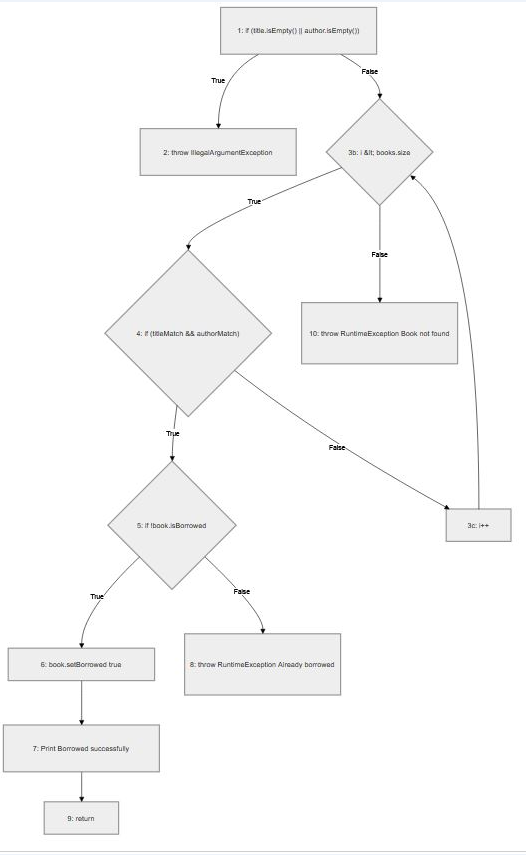
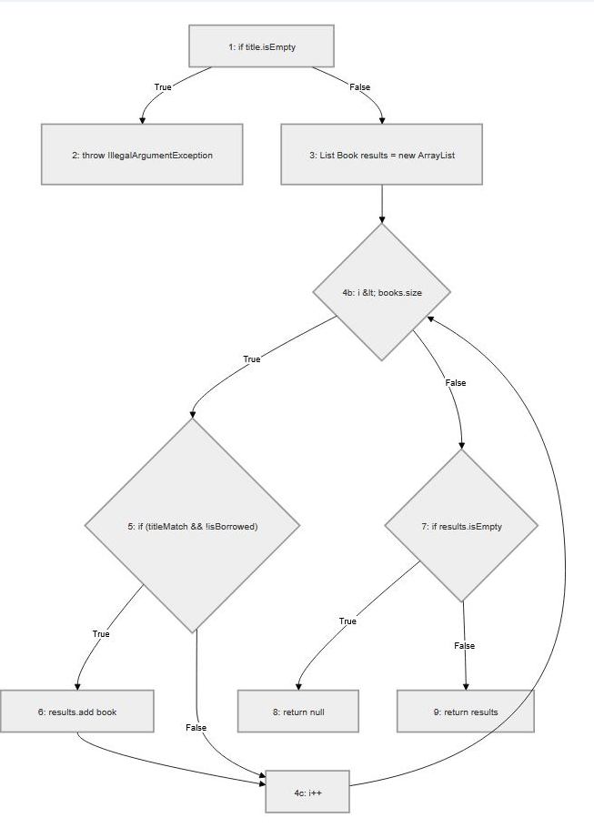

# SI_2026_lab2_132077
132077 Марко Палоски - Лаб 2

CFG за searchBookByTitle

CFG за borrowBook

За третото барање, цикломатската комплексност за функциите searchBookByTitle и borrowBook се пресметува со методот на предикатни јазли по формулата V(G) = P + 1.За функцијата searchBookByTitle се идентификувани 5 предикати, што резултира со цикломатска комплексност V(G) = 5 + 1 = 6.Кај функцијата borrowBook, поради сложените логички услови во if наредбите (|| и &&), вкупниот број на предикати изнесува 6.Со примена на истата формула, крајниот резултат за комплексноста на borrowBook изнесува V(G) = 6 + 1 = 7.
